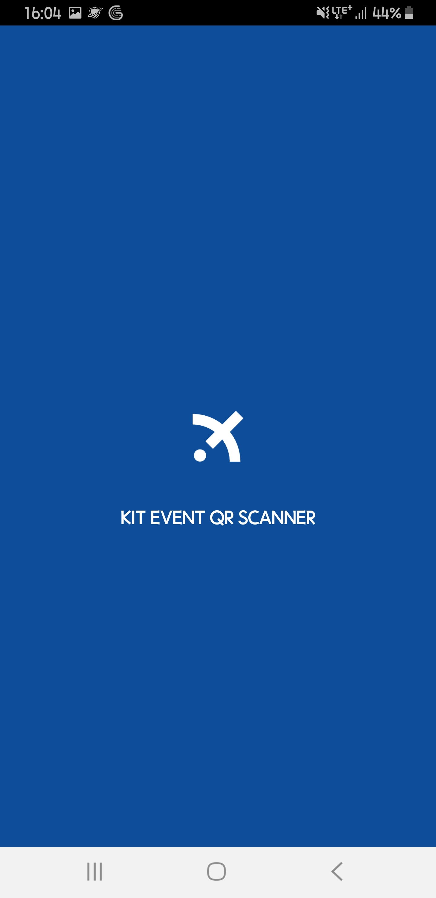
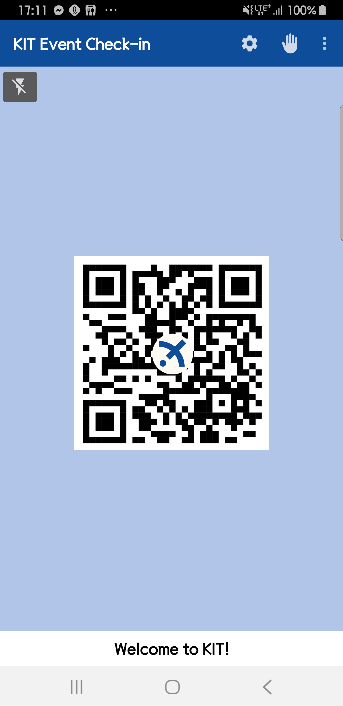
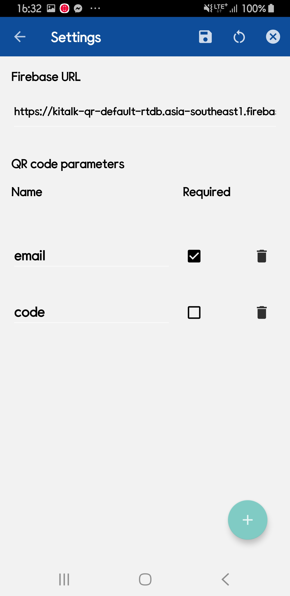
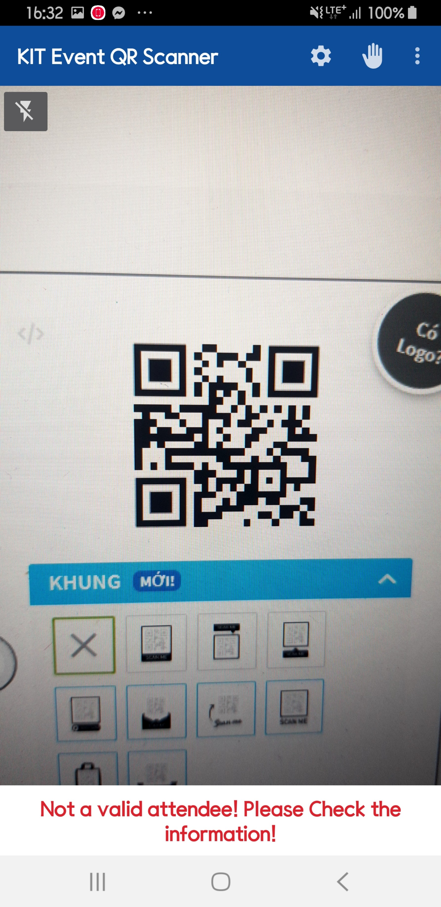
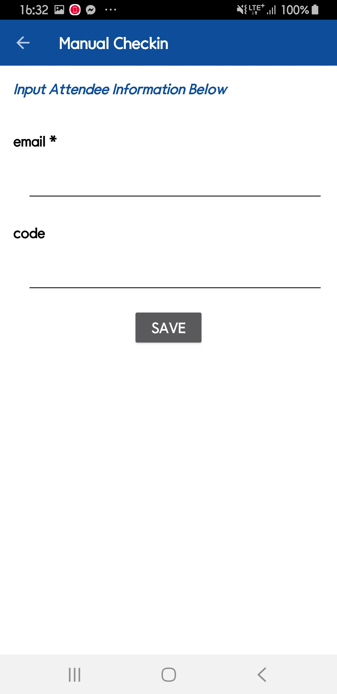

# KIT Event QR Ticket Check-in App!


Cryptography Image Gallery là ứng dụng cho phép các bạn trong ban tổ chức sự kiện của Câu lạc bộ lập trình Học viện Kỹ thuật mật mã (KIT) có thể thực hiện thao tác Check-in cho khán giả tham gia sự kiện.

Ứng dụng cho phép quét mã QR được hiển thị trên vé điện tử và ghi nhận lượt tham gia sự kiện!

Đồng bộ dữ liệu với Firebase Realtime Database
  
.

---

# install  

[](https://dply.me/tm8bc7#install)


[](https://play.google.com/store/apps/details?id=com.kitclub.kiteventqrscanner)

  
# Contributors


# Authors
 - [@Hoàng Văn Giang](https://github.com/HVgiang86/student-management-utt)
 
 <a href="https://www.facebook.com/HVGiang86">Hoàng Giang</a>

<p align="left">
    
<a href="https://github.com/HVgiang86">HVGiang86</a>

<p align="left">
 
 # QR data structure
 
 - Ứng dụng có khả năng scan các mã QR để lấy thông tin người tham dự.
 Data chứa trong mã QR bắt buộc phải ở dạng JSON:
 
  - *Ví dụ:*
 
 ``` 
 {"email": "HVGiang86@gmail.com", "code": "CT050413"}
 ```
 - Data thu được sau khi scan mã QR sẽ được lưu trữ trên firebase Realtime database
 - Một model Attendee khi lưu trữ trên Firebase bao gồm các thông tin:
    - "ID": hash MD5 của String: "KIT" + currentTimeInMilliseconds + Device Serial Number
    - "email": từ QR
    - "code": từ QR
    
 - Trong đó, trường email bắt buộc, trường code có thể trống
 

# Feature
Ứng dụng này cho phép bạn:

 - Check-in tự động bằng cách quét mã QR trên email ticket và ghi nhận lượt tham gia
 - Check-in thủ công
 - Yêu cầu đăng nhập bằng mật khẩu định trước
 - Đồng bộ settings với Database
 - Mã hoá bảo vệ dữ liệu
 - Tốc độ check-in nhanh chóng
 - Đồng bộ online với Firebase
 - Lưu trữ Local với Realm Database
 - Xem lịch sử check-in
 - Xuất lịch sử check-in thành file JSON
 - Cài đặt các tham số của mã QR một cách linh hoạt
 - Có thể bật đèn Flash

# Permission
Ứng dụng yêu cầu quyền quản lý và truy cập hệ thống tập tin

# Screenshot








  

